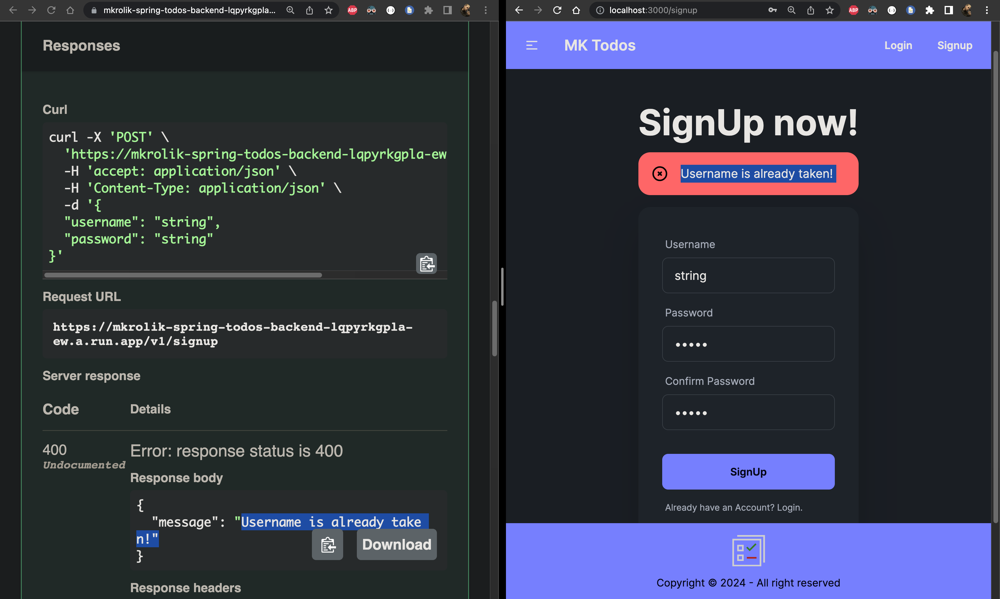
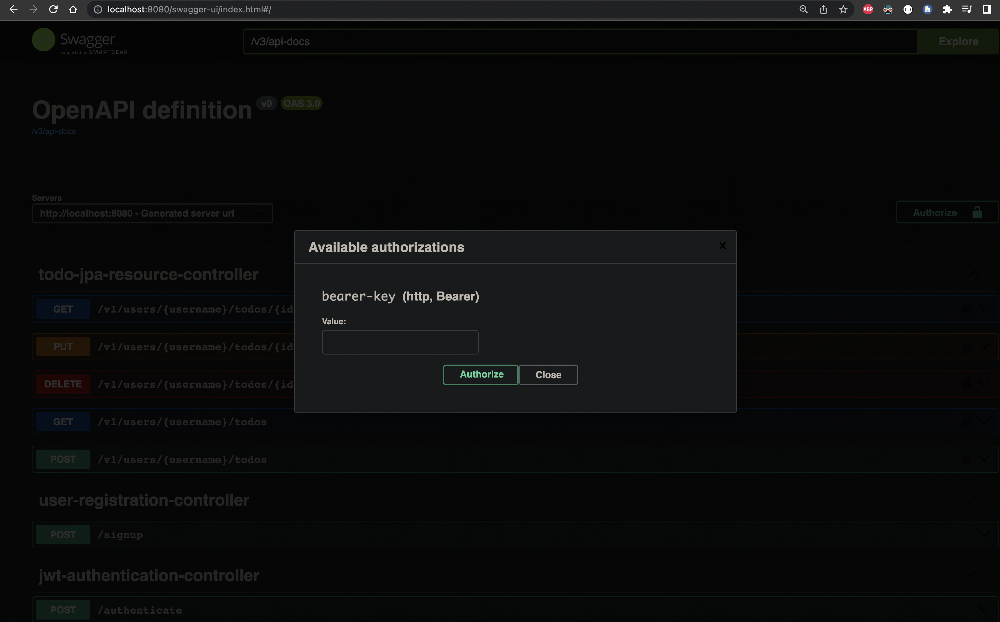

<a name="readme-top"></a>

[![Contributors][contributors-shield]][contributors-url]
[![Forks][forks-shield]][forks-url]
[![Stargazers][stars-shield]][stars-url]
[![Issues][issues-shield]][issues-url]
[![MIT License][license-shield]][license-url]
[![LinkedIn][linkedin-shield]][linkedin-url]

<!-- PROJECT LOGO -->
<br />
<div align="center">
  <a href="https://github.com/MateuszKrolik/React_Next_Ts_TailWind_Todo_FrontEnd">
    
  </a>

<h3 align="center">React_Next_Ts_TailWind_Todo_FrontEnd</h3>
  <p align="center">
    <br />
    <a href="https://github.com/MateuszKrolik/React_Next_Ts_TailWind_Todo_FrontEnd"><strong>Explore the docs »</strong></a>
    <br />
    <br />
    <a href="https://github.com/MateuszKrolik/React_Next_Ts_TailWind_Todo_FrontEnd">View Demo</a>
    ·
    <a href="https://github.com/MateuszKrolik/React_Next_Ts_TailWind_Todo_FrontEnd/issues">Report Bug</a>
    ·
    <a href="https://github.com/MateuszKrolik/React_Next_Ts_TailWind_Todo_FrontEnd/issues">Request Feature</a>
  </p>
</div>

<!-- TABLE OF CONTENTS -->
<details>
  <summary>Table of Contents</summary>
  <ol>
    <li>
      <a href="#about-the-project">About The Project</a>
      <ul>
        <li><a href="#built-with">Built With</a></li>
      </ul>
    </li>
    <li>
      <a href="#getting-started">Getting Started</a>
      <ul>
        <li><a href="#installation">Installation</a></li>
      </ul>
    </li>
    <li><a href="#usage">Usage</a></li>
    <li><a href="#roadmap">Roadmap</a></li>
    <li><a href="#contributing">Contributing</a></li>
    <li><a href="#license">License</a></li>
    <li><a href="#contact">Contact</a></li>
    <li><a href="#acknowledgments">Acknowledgments</a></li>
  </ol>
</details>

<!-- ABOUT THE PROJECT -->

## About The Project

### See the Server-Side-Rendered FrontEnd in a FullStack manner in below videos 😉

https://github.com/MateuszKrolik/React_Next_Ts_TailWind_Todo_FrontEnd/assets/127691471/b3b14815-f707-49cd-951e-3d26d2d2c298

https://github.com/MateuszKrolik/React_Next_Ts_TailWind_Todo_FrontEnd/assets/127691471/4db9a22b-2f51-4bae-8a13-6a3951ebca71

### Server-Side Dynamic Error Display 😀



### Click below image to open the Backends API Docs 🙃

[](https://mkrolik-spring-todos-backend-lqpyrkgpla-ew.a.run.app/swagger-ui/index.html)

<p align="right">(<a href="#readme-top">back to top</a>)</p>

### Built With

<!-- WebTech -->

- [![Next.js][Next.js]][Next.js-url]
- [![React][React]][React-url]
- [![Node.js][Node.js]][Node-url]
- [![JSX][JSX]][JSX-url]
- [![HTML5][HTML5]][HTML5-url]
<!-- Programming Languages -->
- [![TypeScript][TypeScript]][TypeScript-url]
- [![JavaScript][JavaScript]][JavaScript-url]
<!-- State Management -->
- [![Redux Toolkit][Redux Toolkit]][Redux Toolkit-url]
- [![Redux Toolkit Query][Redux Toolkit Query]][Redux Toolkit Query-url]
<!-- Auth -->
- [![JSON Web Tokens][JSON Web Tokens]][JSON Web Tokens-url]
<!-- Styling & Component Libraries -->
- [![TailwindCSS][TailwindCSS]][TailwindCSS-url]
- [![daisyUI][daisyUI]][daisyUI-url]
- [![CSS3][CSS3]][CSS3-url]
<!-- Validation -->
- [![Zod][Zod]][Zod-url]
- [![React Hook Form][React Hook Form]][React Hook Form-url]
- [![Moment.js][Moment.js]][Moment.js-url]
<!-- Build Tools -->
- [![NPM][NPM]][NPM-url]
- [![Webpack][Webpack]][Webpack-url]
<!-- Transpilers -->
- [![SWC][SWC]][SWC-url]
<!-- Containerization -->
- [![Docker][Docker]][Docker-url]
- [![Linux/Unix][Linux/Unix]][Linux/Unix-url]
- [![Bash][Bash]][Bash-url]
<!-- Cloud Technologies -->
- [![Google Cloud Platform][Google Cloud Platform]][Google Cloud Platform-url]
- [![GCP Cloud Build][GCP Cloud Build]][GCP Cloud Build-url]
- [![GCP Artifact Registry][GCP Artifact Registry]][GCP Artifact Registry-url]
- [![GCP Cloud Run][GCP Cloud Run]][GCP Cloud Run-url]
- [![GCP Cloud SQL][GCP Cloud SQL]][GCP Cloud SQL-url]
- [![GCP Secret Manager][GCP Secret Manager]][GCP Secret Manager-url]
- [![GCP IAM][GCP IAM]][GCP IAM-url]
- [![Firebase Hosting][Firebase Hosting]][Firebase Hosting-url]
- [![GitHub Actions][GitHub Actions]][GitHub Actions-url]
<!-- Testing & Linting -->
- [![React Testing Library][React Testing Library]][React Testing Library-url]
- [![Jest][Jest]][Jest-url]
- [![ESLint][ESLint]][ESLint-url]
<!-- Data Formats -->
- [![YAML][YAML]][YAML-url]
- [![JSON][JSON]][JSON-url]
- [![.env][.env]][.env-url]
<!-- IDEs and Editors -->
- [![VSCode][VSCode]][VSCode-url]

<p align="right">(<a href="#readme-top">back to top</a>)</p>

<!-- GETTING STARTED -->

## Getting Started

As a prerequisite I recommend having Node.js, NPM and NPX installed, as well as Docker for Desktop.

For a Smooth Debugging Experience i also recommend using the React & Redux Chrome DevTools.

### Installation

1. Clone the repo
   ```sh
   git clone https://github.com/MateuszKrolik/React_Next_Ts_TailWind_Todo_FrontEnd.git
   ```
2. Build Docker Image
   ```sh
   docker compose up --build -d
   ```
3. Enter your environment variables in `.env` and `GCP Secret Manager`.

```sh
# For the "GCP Secret Manager":
NEXT_PUBLIC_BASE_URL = 'ENTER YOUR NEXT_PUBLIC_BASE_URL';
# For the ".ENV File":
APP_FULL_NAME=YOUR_APP_FULL_NAME;
APP_ACRONYM_UPPERCASE=YOUR_APP_ACRONYM_UPPERCASE;
APP_ACRONYM_LOWERCASE=YOUR_APP_ACRONYM_LOWERCASE;
GCLOUD_PROJECT_NUMBER = YOUR_GCLOUD_PROJECT_NUMBER;
GCLOUD_ID = YOUR_GCLOUD_ID;
```

4. When deploying remember to create a GitHub master branch trigger in GCP Cloud Build, and don't forget to set all the necessary GCP IAM Roles using my Recommended Custom Service Account BASH Script:

```sh
chmod +x gcloud_custom.sh
```

```bash
#!/bin/bash

source .env

gcloud iam service-accounts create "build-${APP_ACRONYM_LOWERCASE}-dev-sa" \
  --description="Service account for build process in ${APP_FULL_NAME} development environment" \
  --display-name="Build ${APP_ACRONYM_UPPERCASE} Dev SA" \
  --project=$GCLOUD_ID

SA_EMAIL="build-${APP_ACRONYM_LOWERCASE}-dev-sa@${GCLOUD_ID}.iam.gserviceaccount.com"

gcloud projects add-iam-policy-binding $GCLOUD_ID \
  --member="serviceAccount:$SA_EMAIL" \
  --role="roles/artifactregistry.writer"

gcloud projects add-iam-policy-binding $GCLOUD_ID \
  --member="serviceAccount:$SA_EMAIL" \
  --role="roles/run.admin"

gcloud projects add-iam-policy-binding $GCLOUD_ID \
  --member="serviceAccount:$SA_EMAIL" \
  --role="roles/iam.serviceAccountUser"

gcloud projects add-iam-policy-binding $GCLOUD_ID \
  --member="serviceAccount:$SA_EMAIL" \
  --role="roles/secretmanager.secretAccessor"

gcloud projects add-iam-policy-binding $GCLOUD_ID \
  --member="serviceAccount:$SA_EMAIL" \
  --role="roles/cloudbuild.builds.editor"

gcloud projects add-iam-policy-binding $GCLOUD_ID \
  --member="serviceAccount:$SA_EMAIL" \
  --role="roles/logging.admin"

gcloud projects add-iam-policy-binding $GCLOUD_ID \
  --member="serviceAccount:$SA_EMAIL" \
  --role="roles/firebasehosting.admin"


gcloud projects get-iam-policy $GCLOUD_ID \
  --flatten="bindings[].members" \
  --format='table(bindings.role)' \
  --filter="bindings.members:$SA_EMAIL"

# ROLE
# roles/artifactregistry.writer
# roles/cloudbuild.builds.editor
# roles/iam.serviceAccountUser
# roles/logging.admin
# roles/logging.logWriter
# roles/run.admin
# roles/secretmanager.secretAccessor
# roles/firebasehosting.admin

# To avoid CloudBuild Error - "Permission denied on secret":

gcloud projects add-iam-policy-binding $GCLOUD_ID \
  --member="serviceAccount:$GCLOUD_PROJECT_NUMBER-compute@developer.gserviceaccount.com" \
  --role="roles/secretmanager.secretAccessor"

gcloud projects get-iam-policy $GCLOUD_ID \
  --flatten="bindings[].members" \
  --format='table(bindings.role)' \
  --filter="bindings.members:$GCLOUD_PROJECT_NUMBER-compute@developer.gserviceaccount.com"

# ROLE
# roles/editor
# roles/secretmanager.secretAccessor
```

```sh
./gcloud_custom.sh
```

<p align="right">(<a href="#readme-top">back to top</a>)</p>

<!-- USAGE EXAMPLES -->

## Usage

_Below you'll find visual usage example representation if form of videos.
To test these out yourself visit this [Link](https://spring-next-fullstack-todo-app.firebaseapp.com) 😉_

https://github.com/MateuszKrolik/React_Next_Ts_TailWind_Todo_FrontEnd/assets/127691471/b3b14815-f707-49cd-951e-3d26d2d2c298

https://github.com/MateuszKrolik/React_Next_Ts_TailWind_Todo_FrontEnd/assets/127691471/4db9a22b-2f51-4bae-8a13-6a3951ebca71

<p align="right">(<a href="#readme-top">back to top</a>)</p>

<!-- ROADMAP -->

## Roadmap

<!-- Architecture and Core Technologies -->

- [x] Frontend Reactive Single-Page-App (SPA) via React Library
- [x] Server-Side-Rendering (SSR) via Next.js React Meta-Framework
- [x] App-Wide State Management via Redux Toolkit (RTK)
- [x] HTTP Caching and Request Interceptors via Redux Toolkit Query (RTK)
- [x] Cross-Origin-Resource-Sharing (CORS)
- [x] TypeScript for Static & Strong Type Linting Checks

<!-- Authentication and Authorization -->

- [x] Authentication and Authorization
  - [x] JSON Web Tokens(JWT)

<!-- Testing -->

- [x] Test-Driven-Development(TDD) - Manual, Unit and Integration via:
  - [x] React Testing Library
  - [x] Factory Design Pattern (Mock Redux Store)
  - [x] Jest

<!-- Validation -->

- [x] Validation and Form State Handling via:
  - [x] React-Hook-Form
  - [x] Zod
  - [x] Moment.js (Dates)

<!-- Deployment and Infrastructure -->

- [x] Infrastructure-as-Code (IaC) via CloudBuild YAML file
- [x] Automatized Dockerized CI/CD & IaC Serverless Deployment via:
  - [x] GitHub Actions - Master Branch Trigger
  - [x] GCP Cloud Build (IaC & CI/CD)
  - [x] GCP Cloud Run (FaaS/PaaS)
  - [x] GCP Artifact Registry
  - [x] GCP Secret Manager (.ENV)
  - [x] GCP IAM Roles (Least Priveleged Principle)
- [x] Traffic Re-Routing to FireBase Hosting

<!-- Security -->

- [x] Secure HTTP Response Headers (Helmet.js)
- [x] SSL/TLS Encryption
- [x] Environment Variables for Securing Sensitive Data

<!-- User Interface and Experience -->

- [x] DaisyUI TailwindCSS Component Library
- [x] DarkMode
- [x] Mobile Responsiveness
- [x] Image Optimization (`<Image/>` Next.js Component with Sharp Library)
- [x] Font Optimization (Modularization)

<!-- Other Features and Best Practices -->

- [x] Dynamic routing (Next.js AppRouter)
- [x] Error Handling (Server-Side Alert Dynamic Display)
- [x] AJAX

See the [open issues](https://github.com/MateuszKrolik/React_Next_Ts_TailWind_Todo_FrontEnd/issues) for a full list of proposed features (and known issues).

<p align="right">(<a href="#readme-top">back to top</a>)</p>

<!-- CONTRIBUTING -->

## Contributing

Contributions are what make the open source community such an amazing place to learn, inspire, and create. Any contributions you make are **greatly appreciated**.

If you have a suggestion that would make this better, please fork the repo and create a pull request. You can also simply open an issue with the tag "enhancement".
Don't forget to give the project a star! Thanks again!

1. Fork the Project
2. Create your Feature Branch (`git checkout -b feature/AmazingFeature`)
3. Commit your Changes (`git commit -m 'Add some AmazingFeature'`)
4. Push to the Branch (`git push origin feature/AmazingFeature`)
5. Open a Pull Request

<p align="right">(<a href="#readme-top">back to top</a>)</p>

<!-- LICENSE -->

## License

Distributed under the MIT License. See `LICENSE` for more information.

<p align="right">(<a href="#readme-top">back to top</a>)</p>

<!-- CONTACT -->

## Contact

Mateusz Królik - [Mateusz Królik](https://www.linkedin.com/in/mateusz-kr%C3%B3lik-8b1862262/) - [mateuszkrolik87@gmail.com](mailto:mateuszkrolik7@gmail.com)

Project Link: [Project Link](https://spring-next-fullstack-todo-app.firebaseapp.com)

API Docs Link: [API Docs Link](https://mkrolik-spring-todos-backend-lqpyrkgpla-ew.a.run.app/swagger-ui/index.html)

GitHub Repository Link: [GitHub Repository Link](https://github.com/MateuszKrolik/React_Next_Ts_TailWind_Todo_FrontEnd)

<p align="right">(<a href="#readme-top">back to top</a>)</p>

<!-- ACKNOWLEDGMENTS -->

## Acknowledgments

- [Img Shields](https://shields.io)
- [GitHub Emoji Cheat Sheet](https://www.webpagefx.com/tools/emoji-cheat-sheet)
- [Malven's Flexbox Cheatsheet](https://flexbox.malven.co/)
- [Malven's Grid Cheatsheet](https://grid.malven.co/)
- [SVG Repo](https://www.svgrepo.com/)

<p align="right">(<a href="#readme-top">back to top</a>)</p>

<!-- MARKDOWN LINKS & IMAGES -->
<!-- https://www.markdownguide.org/basic-syntax/#reference-style-links -->

[contributors-shield]: https://img.shields.io/github/contributors/MateuszKrolik/React_Next_Ts_TailWind_Todo_FrontEnd.svg?style=for-the-badge
[contributors-url]: https://github.com/MateuszKrolik/React_Next_Ts_TailWind_Todo_FrontEnd/graphs/contributors
[forks-shield]: https://img.shields.io/github/forks/MateuszKrolik/React_Next_Ts_TailWind_Todo_FrontEnd.svg?style=for-the-badge
[forks-url]: https://github.com/MateuszKrolik/React_Next_Ts_TailWind_Todo_FrontEnd/network/members
[stars-shield]: https://img.shields.io/github/stars/MateuszKrolik/React_Next_Ts_TailWind_Todo_FrontEnd.svg?style=for-the-badge
[stars-url]: https://github.com/MateuszKrolik/React_Next_Ts_TailWind_Todo_FrontEnd/stargazers
[issues-shield]: https://img.shields.io/github/issues/MateuszKrolik/React_Next_Ts_TailWind_Todo_FrontEnd.svg?style=for-the-badge
[issues-url]: https://github.com/MateuszKrolik/React_Next_Ts_TailWind_Todo_FrontEnd/issues
[license-shield]: https://img.shields.io/github/license/MateuszKrolik/React_Next_Ts_TailWind_Todo_FrontEnd.svg?style=for-the-badge
[license-url]: https://github.com/MateuszKrolik/React_Next_Ts_TailWind_Todo_FrontEnd/blob/master/LICENSE
[linkedin-shield]: https://img.shields.io/badge/-LinkedIn-black.svg?style=for-the-badge&logo=linkedin&colorB=555
[linkedin-url]: https://linkedin.com/in/mateusz-królik-8b1862262
[product-screenshot]: images/screenshot.jpg
[React]: https://img.shields.io/badge/React-20232A?style=for-the-badge&logo=react&logoColor=61DAFB
[React-url]: https://reactjs.org/
[Webpack]: https://img.shields.io/badge/Webpack-8DD6F9?style=for-the-badge&logo=webpack&logoColor=black
[Webpack-url]: https://webpack.js.org/
[Docker]: https://img.shields.io/badge/Docker-2CA5E0?style=for-the-badge&logo=docker&logoColor=white
[Docker-url]: https://www.docker.com/
[Linux/Unix]: https://img.shields.io/badge/Linux-FCC624?style=for-the-badge&logo=linux&logoColor=black
[Linux/Unix-url]: https://www.linux.org/
[Node.js]: https://img.shields.io/badge/Node.js-43853D?style=for-the-badge&logo=node.js&logoColor=white
[Node-url]: https://nodejs.org/
[JavaScript]: https://img.shields.io/badge/JavaScript-F7DF1E?style=for-the-badge&logo=javascript&logoColor=black
[JavaScript-url]: https://www.javascript.com/
[NPM]: https://img.shields.io/badge/npm-CB3837?style=for-the-badge&logo=npm&logoColor=white
[NPM-url]: https://www.npmjs.com/
[JSON Web Tokens]: https://img.shields.io/badge/JSON_Web_Tokens-000000?style=for-the-badge&logo=jsonwebtokens&logoColor=white
[JSON Web Tokens-url]: https://jwt.io/
[Google Cloud Platform]: https://img.shields.io/badge/Google_Cloud-4285F4?style=for-the-badge&logo=google-cloud&logoColor=white
[Google Cloud Platform-url]: https://cloud.google.com/
[Firebase Hosting]: https://img.shields.io/badge/Firebase_Hosting-FFCA28?style=for-the-badge&logo=firebase&logoColor=black
[Firebase Hosting-url]: https://firebase.google.com/products/hosting/
[HTML5]: https://img.shields.io/badge/HTML5-E34F26?style=for-the-badge&logo=html5&logoColor=white
[HTML5-url]: https://www.w3.org/html/
[CSS3]: https://img.shields.io/badge/CSS3-1572B6?style=for-the-badge&logo=css3&logoColor=white
[CSS3-url]: https://www.w3.org/Style/CSS/Overview.en.html
[Bash]: https://img.shields.io/badge/Bash-4EAA4B?style=for-the-badge&logo=gnu-bash&logoColor=white
[Bash-url]: https://www.gnu.org/software/bash/
[TypeScript]: https://img.shields.io/badge/TypeScript-3178C6?style=for-the-badge&logo=typescript&logoColor=white
[TypeScript-url]: https://www.typescriptlang.org/
[GCP Cloud Build]: https://img.shields.io/badge/GCP_Cloud_Build-4285F4?style=for-the-badge&logo=data:image/svg+xml;base64,PHN2ZyB4bWxucz0iaHR0cDovL3d3dy53My5vcmcvMjAwMC9zdmciIHhtbG5zOnhsaW5rPSJodHRwOi8vd3d3LnczLm9yZy8xOTk5L3hsaW5rIiB2aWV3Qm94PSIwIDAgNzIgODEiIGZpbGw9IiNmZmYiIGZpbGwtcnVsZT0iZXZlbm9kZCIgc3Ryb2tlPSIjMDAwIiBzdHJva2UtbGluZWNhcD0icm91bmQiIHN0cm9rZS1saW5lam9pbj0icm91bmQiPjx1c2UgeGxpbms6aHJlZj0iI0EiIHg9Ii41IiB5PSIuNSIvPjxzeW1ib2wgaWQ9IkEiIG92ZXJmbG93PSJ2aXNpYmxlIj48ZyBzdHJva2U9Im5vbmUiIGZpbGwtcnVsZT0ibm9uemVybyI+PHBhdGggZD0iTTM1LjMyOSA1Ny4zOTlsMTQuMzYtOC4yODFWMzIuNTU1bC00LjgxNC0yLjgxNS0xNC4zNiAyNC44ODUgNC44MTQgMi43NzR6IiBmaWxsPSIjNDI4NWY0Ii8+PHBhdGggZD0iTTIwLjk2OSAzMi41NTV2MTYuNTYzbDQuODE0IDIuNzc0IDE0LjQwMS0yNC44NDQtNC44NTUtMi44MTUtMTQuMzYgOC4zMjJ6IiBmaWxsPSIjNjY5ZGY2Ii8+PHBhdGggZD0iTTMyLjUxNCA2Mi4zMzVsLTE3LjIxNi05Ljk1NFYzMi41NTVMMCAyMy43MDJ2MzcuNTMyTDMyLjUxNCA4MFY2Mi4zMzV6TTE4LjExMyAyNy42NTlsMTcuMjE2LTkuOTU0IDE3LjIxNiA5Ljk1NCAxNS4zMzktOC44NTNMMzUuMzI5IDAgMi43NzQgMTguODA3bDE1LjMzOSA4Ljg1M3pNNTUuMzYgNTIuMzgxbC0xNy4yMTYgOS45NTRWODBsMzIuNTU1LTE4Ljc2NlYyMy43MDJMNTUuMzYgMzIuNTU1djE5LjgyN3oiIGZpbGw9IiNhZWNiZmEiLz48L2c+PC9zeW1ib2w+PC9zdmc+
[GCP Cloud Build-url]: https://cloud.google.com/cloud-build
[GCP Artifact Registry]: https://img.shields.io/badge/GCP_Artifact_Registry-FFFFFF?style=for-the-badge&logo=data:image/svg+xml;base64,PHN2ZyB2ZXJzaW9uPSIxLjEiIGJhc2VQcm9maWxlPSJ0aW55IiBpZD0iTGF5ZXJfMSIgeG1sbnM9Imh0dHA6Ly93d3cudzMub3JnLzIwMDAvc3ZnIiB4bWxuczp4bGluaz0iaHR0cDovL3d3dy53My5vcmcvMTk5OS94bGluayIKCSB4PSIwcHgiIHk9IjBweCIgd2lkdGg9IjI0cHgiIGhlaWdodD0iMjRweCIgdmlld0JveD0iMCAwIDI0IDI0IiBvdmVyZmxvdz0idmlzaWJsZSIgeG1sOnNwYWNlPSJwcmVzZXJ2ZSI+CjxnID4KCTxyZWN0IHk9IjAiIGZpbGw9Im5vbmUiIHdpZHRoPSIyNCIgaGVpZ2h0PSIyNCIvPgoJPHBvbHlnb24gZmlsbC1ydWxlPSJldmVub2RkIiBmaWxsPSIjNUM4NURFIiBwb2ludHM9IjYsMi40IDAuOCw1LjQgMC44LDE5LjEgNiwyMi4xIDYsMTkuNSAzLDE3LjggMyw2LjcgNiw1IAkiLz4KCTxwb2x5Z29uIGZpbGwtcnVsZT0iZXZlbm9kZCIgZmlsbD0iIzMzNjdENiIgcG9pbnRzPSIwLjgsOCAwLjgsMTYuNSAzLDE3LjggMyw2LjcgCSIvPgoJPHBvbHlnb24gZmlsbC1ydWxlPSJldmVub2RkIiBmaWxsPSIjMzM2N0Q2IiBwb2ludHM9IjAuOCw4IDMsNy41IDMsNi43IAkiLz4KCTxwb2x5Z29uIGZpbGwtcnVsZT0iZXZlbm9kZCIgZmlsbD0iIzVDODVERSIgcG9pbnRzPSIxOCwyLjQgMTgsNSAyMSw2LjcgMjEsMTcuOCAxOCwxOS41IDE4LDIyLjEgMjMuMiwxOS4xIDIzLjIsNS40IAkiLz4KCTxwb2x5Z29uIGZpbGwtcnVsZT0iZXZlbm9kZCIgZmlsbD0iIzMzNjdENiIgcG9pbnRzPSIyMSwxNy44IDIzLjIsMTYuNSAyMy4yLDggMjEsNi43IAkiLz4KCTxwb2x5Z29uIGZpbGwtcnVsZT0iZXZlbm9kZCIgZmlsbD0iIzMzNjdENiIgcG9pbnRzPSIyMSw3LjUgMjMuMiw4IDIxLDYuNyAJIi8+Cgk8cG9seWdvbiBmaWxsLXJ1bGU9ImV2ZW5vZGQiIGZpbGw9IiMzMzY3RDYiIHBvaW50cz0iMjEsMTcuMSAyMSwxNy44IDIzLjIsMTYuNSAJIi8+Cgk8ZyB0cmFuc2Zvcm09InRyYW5zbGF0ZSg2Ljg2MDAwMCwgNi41MDAwMDApIj4KCQk8ZyB0cmFuc2Zvcm09InRyYW5zbGF0ZSg0LjU0MDAwMCwgMC4wMDAwMDApIj4KCQkJPHBvbHlnb24gZmlsbC1ydWxlPSJldmVub2RkIiBmaWxsPSIjNUM4NURFIiBwb2ludHM9IjAuNiwtMSAtMi40LDAuNiAwLjYsMi4yIDMuNiwwLjYgCQkJIi8+CgkJCTxwb2x5Z29uIGZpbGwtcnVsZT0iZXZlbm9kZCIgZmlsbD0iIzMzNjdENiIgcG9pbnRzPSIxLDUuOSAzLjksNC4zIDMuOSwxLjIgMSwyLjggCQkJIi8+CgkJCTxwb2x5Z29uIGZpbGwtcnVsZT0iZXZlbm9kZCIgZmlsbD0iIzMzNjdENiIgcG9pbnRzPSIwLjMsMi44IC0yLjcsMS4yIC0yLjcsNC4zIDAuMyw1LjkgCQkJIi8+CgkJPC9nPgoJCTxnIHRyYW5zZm9ybT0idHJhbnNsYXRlKDAuMDAwMDAwLCA3Ljk3NjE5MCkiPgoJCQk8cG9seWdvbiBmaWxsLXJ1bGU9ImV2ZW5vZGQiIGZpbGw9IiM1Qzg1REUiIHBvaW50cz0iMS43LC0zLjEgLTEuMiwtMS41IDEuNywwLjEgNC41LC0xLjUgCQkJIi8+CgkJCTxwb2x5Z29uIGZpbGwtcnVsZT0iZXZlbm9kZCIgZmlsbD0iIzMzNjdENiIgcG9pbnRzPSIxLjksMy44IDQuOCwyLjIgNC44LC0xIDEuOSwwLjYgCQkJIi8+CgkJCTxwb2x5Z29uIGZpbGwtcnVsZT0iZXZlbm9kZCIgZmlsbD0iIzMzNjdENiIgcG9pbnRzPSIxLjQsMC42IC0xLjUsLTEgLTEuNSwyLjIgMS40LDMuOCAJCQkiLz4KCQk8L2c+CgkJPGcgdHJhbnNmb3JtPSJ0cmFuc2xhdGUoOS4zNjAwMDAsIDcuOTc2MTkwKSI+CgkJCTxwb2x5Z29uIGZpbGwtcnVsZT0iZXZlbm9kZCIgZmlsbD0iIzVDODVERSIgcG9pbnRzPSItMC43LC0zLjEgLTMuNiwtMS41IC0wLjcsMC4xIDIuMiwtMS41IAkJCSIvPgoJCQk8cG9seWdvbiBmaWxsLXJ1bGU9ImV2ZW5vZGQiIGZpbGw9IiMzMzY3RDYiIHBvaW50cz0iLTAuNCwzLjggMi41LDIuMiAyLjUsLTEgLTAuNCwwLjYgCQkJIi8+CgkJCTxwb2x5Z29uIGZpbGwtcnVsZT0iZXZlbm9kZCIgZmlsbD0iIzMzNjdENiIgcG9pbnRzPSItMSwwLjYgLTMuOSwtMSAtMy45LDIuMiAtMSwzLjggCQkJIi8+CgkJPC9nPgoJPC9nPgo8L2c+Cjwvc3ZnPgo=
[GCP Artifact Registry-url]: https://cloud.google.com/artifact-registry
[GCP Cloud Run]: https://img.shields.io/badge/GCP_Cloud_Run-808080?style=for-the-badge&logo=data:image/svg+xml;base64,PD94bWwgdmVyc2lvbj0iMS4wIiBlbmNvZGluZz0iVVRGLTgiPz4KPCEtLSBVcGxvYWRlZCB0bzogU1ZHIFJlcG8sIHd3dy5zdmdyZXBvLmNvbSwgR2VuZXJhdG9yOiBTVkcgUmVwbyBNaXhlciBUb29scyAtLT4KPHN2ZyB3aWR0aD0iODAwcHgiIGhlaWdodD0iODAwcHgiIHZpZXdCb3g9IjAgLTEyLjUgMjU2IDI1NiIgdmVyc2lvbj0iMS4xIiB4bWxucz0iaHR0cDovL3d3dy53My5vcmcvMjAwMC9zdmciIHhtbG5zOnhsaW5rPSJodHRwOi8vd3d3LnczLm9yZy8xOTk5L3hsaW5rIiBwcmVzZXJ2ZUFzcGVjdFJhdGlvPSJ4TWlkWU1pZCI+CgkJPGc+CgkJCQk8cGF0aCBkPSJNNzUuMzkwMTQ3LDAgQzY3LjE5NjQzNjUsMC4xNDQyNDk0NDMgNTkuNjkyNjE0Nyw0LjYxOTQwMzEyIDU1LjY3MDczNSwxMS43NTk0NjU1IEw1NS42NzA3MzUsMTEuNzU5NDY1NSBMMy4wNTI3NTcyNCwxMDIuOTk1ODEzIEMtMS4wMTc1ODU3NSwxMTAuMDc5NDMgLTEuMDE3NTg1NzUsMTE4Ljc5MTk4MiAzLjA1Mjc1NzI0LDEyNS44NzUwMjkgTDMuMDUyNzU3MjQsMTI1Ljg3NTAyOSBMNTUuNjUwNzc5NSwyMTcuODcxOTY0IEM1OS42MzE2MDgsMjI1LjExMTIzNCA2Ny4xMTQ5MDQyLDIyOS43MzM0ODggNzUuMzY5NjIxNCwyMzAuMDUyMjA1IEw3NS4zNjk2MjE0LDIzMC4wNTIyMDUgTDE4MC41ODYxOTIsMjMwLjA1MjIwNSBDMTg4Ljg0MDkwOSwyMjkuNzY4MjY3IDE5Ni4zMzc4ODksMjI1LjE2NDgyOSAyMDAuMzI1NTU5LDIxNy45MzI0MDEgTDIwMC4zMjU1NTksMjE3LjkzMjQwMSBMMjUyLjkyMzU4MSwxMjYuNDU1NDQ4IEMyNTQuOTczMjkyLDEyMi44NTcxOTQgMjU1Ljk5Nzg2MiwxMTguODUxMjc4IDI1NS45OTc4NjIsMTE0Ljg0NTkzMyBMMjU1Ljk5Nzg2MiwxMTQuODQ1OTMzIEMyNTUuOTk3ODYyLDExMC44NDA1ODggMjU0Ljk3MzI5MiwxMDYuODM0NjczIDI1Mi45MjM1ODEsMTAzLjIzNTg0OSBMMjUyLjkyMzU4MSwxMDMuMjM1ODQ5IEwyMDAuMzI1NTU5LDExLjc1OTQ2NTUgQzE5Ni4zMDA4MjksNC42MjIyNTM5IDE4OC43OTkyODcsMC4xNDgyNDA1MzUgMTgwLjYwNjE0NywwIEwxODAuNjA2MTQ3LDAgTDc1LjM5MDE0NywwIFoiIGZpbGw9IiM0Mjg1RjQiPgoNPC9wYXRoPgoJCQkJPHBhdGggZD0iTTIzNi40OTUxNzgsMTU1LjAyNzI0OSBMMjAwLjMyNTU1OSwyMTcuOTMyNDAxIEMxOTYuMzM3ODg5LDIyNS4xNjQ4MjkgMTg4Ljg0MDkwOSwyMjkuNzY4MjY3IDE4MC41ODYxOTIsMjMwLjA1MjIwNSBMMTQwLjUxMDE1OCwyMzAuMDUyMjA1IEw4Mi4wMzgxMDc4LDE3MS4wNTcxNDcgTDk5LjI3NTYzMTIsMTE1LjQ3Mzc4OSBMODIuMDM4MTA3OCw1OS4yNTQxMzYzIEw5OS43NDMxNTksNzEuMTQ3MDE4MyBMMTIzLjU0ODg3OCw5NS4xNjU5NzU5IEwxMTIuNDI5MTI4LDU5LjI1NDEzNjMgTDE5NS44MDQxNjYsMTE1LjI2MTY5MSBMMjM2LjQ5NTE3OCwxNTUuMDI3MjQ5IFoiIGZpbGwtb3BhY2l0eT0iMC4wNyIgZmlsbD0iIzAwMDAwMCIgZmlsbC1ydWxlPSJub256ZXJvIj4KDTwvcGF0aD4KCQkJCTxwYXRoIGQ9Ik04Mi4wMzgyNzg4LDU5LjI1MzkwODIgTDk5Ljc0MzMzMDEsNzEuMTQ3MzYwNCBMMTEzLjYyMjA2NSwxMTUuNzY1NDgxIEw5OS45OTAyMDc2LDE1OS4wNDMxNjQgTDgyLjAzODI3ODgsMTcxLjA1NzQ5IEw5OS4zODA3MTA5LDExNS4yNjE0NjMgTDgyLjAzODI3ODgsNTkuMjUzOTA4MiBaIE0xMjcuMzg1NDU3LDc5LjA4OTkxNzEgTDEzNS45Nzc3MDcsMTA2Ljg4MTU5NiBMMTY4Ljk2NjkyNywxMDYuODgxNTk2IEwxMjcuMzg1NDU3LDc5LjA4OTkxNzEgWiBNMTk1LjgwNDE2NiwxMTUuMjYxNzQ4IEwxMTIuNDI5MTI4LDE3MS4wNTcyMDQgTDEyOS43NzE1NiwxMTUuMjYxNzQ4IEwxMTIuNDI5MTI4LDU5LjI1MzYyMzIgTDE5NS44MDQxNjYsMTE1LjI2MTc0OCBaIiBmaWxsPSIjRkZGRkZGIj4KDTwvcGF0aD4KCQk8L2c+Cjwvc3ZnPg==
[GCP Cloud Run-url]: https://cloud.google.com/run
[GCP Cloud SQL]: https://img.shields.io/badge/GCP_Cloud_SQL-4285F4?style=for-the-badge&logo=data:image/svg+xml;base64,PHN2ZyB4bWxucz0iaHR0cDovL3d3dy53My5vcmcvMjAwMC9zdmciIHhtbG5zOnhsaW5rPSJodHRwOi8vd3d3LnczLm9yZy8xOTk5L3hsaW5rIiB2aWV3Qm94PSIwIDAgNjAgODEiIGZpbGw9IiNmZmYiIGZpbGwtcnVsZT0iZXZlbm9kZCIgc3Ryb2tlPSIjMDAwIiBzdHJva2UtbGluZWNhcD0icm91bmQiIHN0cm9rZS1saW5lam9pbj0icm91bmQiPjx1c2UgeGxpbms6aHJlZj0iI0EiIHg9Ii41IiB5PSIuNSIvPjxzeW1ib2wgaWQ9IkEiIG92ZXJmbG93PSJ2aXNpYmxlIj48ZyBzdHJva2U9Im5vbmUiPjxwYXRoIGQ9Ik0wIDMzLjc2VjQ1LjhsMjkuMzIgMTUuNlY0OS4zNkwwIDMzLjc2em0wIDE4LjZWNjQuNEwyOS4zMiA4MFY2Ny45NkwwIDUyLjM2eiIgZmlsbD0iI2FlY2JmYSIvPjxwYXRoIGQ9Ik0yOS4zMiA2MS40bDI5LjMyLTE1LjZWMzMuNzZsLTI5LjMyIDE1LjZWNjEuNHptMCAxOC42bDI5LjMyLTE1LjZWNTIuMzZsLTI5LjMyIDE1LjZWODB6IiBmaWxsPSIjNjY5ZGY2Ii8+PHBhdGggZD0iTTU4LjY0IDI3LjY0VjE1LjZMMjkuMzIgMHYxMi4wNGwyOS4zMiAxNS42eiIgZmlsbD0iIzQyODVmNCIvPjxwYXRoIGQ9Ik0yOS4zMiAwTDAgMTUuNnYxMi4wNGwyOS4zMi0xNS42VjB6IiBmaWxsPSIjNjY5ZGY2Ii8+PHBhdGggZD0iTTAgMTUuNDh2MTIuMDhsMjkuMzIgMTUuNlYzMS4wOEwwIDE1LjQ4eiIgZmlsbD0iI2FlY2JmYSIvPjxwYXRoIGQ9Ik0yOS4zMiA0My4xNmwyOS4zMi0xNS42VjE1LjQ4bC0yOS4zMiAxNS42djEyLjA4eiIgZmlsbD0iIzY2OWRmNiIvPjwvZz48L3N5bWJvbD48L3N2Zz4=
[GCP Cloud SQL-url]: https://cloud.google.com/sql
[GCP Secret Manager]: https://img.shields.io/badge/GCP_Secret_Manager-FFFFFF?style=for-the-badge&logo=data:image/svg+xml;base64,PD94bWwgdmVyc2lvbj0iMS4wIiBlbmNvZGluZz0idXRmLTgiPz4KDTwhLS0gVXBsb2FkZWQgdG86IFNWRyBSZXBvLCB3d3cuc3ZncmVwby5jb20sIEdlbmVyYXRvcjogU1ZHIFJlcG8gTWl4ZXIgVG9vbHMgLS0+Cjxzdmcgd2lkdGg9IjgwMHB4IiBoZWlnaHQ9IjgwMHB4IiB2aWV3Qm94PSIwIDAgMjQgMjQiIHZlcnNpb249IjEuMSIgeG1sbnM9Imh0dHA6Ly93d3cudzMub3JnLzIwMDAvc3ZnIiB4bWxuczp4bGluaz0iaHR0cDovL3d3dy53My5vcmcvMTk5OS94bGluayI+CiAgICA8ZyBzdHJva2U9Im5vbmUiIHN0cm9rZS13aWR0aD0iMSIgZmlsbD0ibm9uZSIgZmlsbC1ydWxlPSJldmVub2RkIj4KICAgICAgICA8ZyB0cmFuc2Zvcm09InRyYW5zbGF0ZSgyLjAwMDAwMCwgNi4wMDAwMDApIiBmaWxsPSIjNDI4NUY0IiBmaWxsLXJ1bGU9Im5vbnplcm8iPgogICAgICAgICAgICA8cGF0aCBkPSJNMjAsOS40MTQ2OTEyNWUtMTQgTDIwLDExLjg4Njc5MjUgTDE2LjAzNzczNTgsMTEuODg2NzkyNSBDMTUuOTMzNTMxMiwxMS44ODY3OTI1IDE1Ljg0OTA1NjYsMTEuODAyMzE3OSAxNS44NDkwNTY2LDExLjY5ODExMzIgTDE1Ljg0OTA1NjYsMTAuNTY2MDM3NyBDMTUuODQ5MDU2NiwxMC40NjE4MzMxIDE1LjkzMzUzMTIsMTAuMzc3MzU4NSAxNi4wMzc3MzU4LDEwLjM3NzM1ODUgTDE4LjQ5MDA1NjYsMTAuMzc3IEwxOC40OTAwNTY2LDEuNTA5IEwxNi4wMzc3MzU4LDEuNTA5NDMzOTYgQzE1LjkzMzUzMTIsMS41MDk0MzM5NiAxNS44NDkwNTY2LDEuNDI0OTU5MzkgMTUuODQ5MDU2NiwxLjMyMDc1NDcyIEwxNS44NDkwNTY2LDAuMTg4Njc5MjQ1IEMxNS44NDkwNTY2LDAuMDg0NDc0NTc1NSAxNS45MzM1MzEyLDkuNDExMDU0MzRlLTE0IDE2LjAzNzczNTgsOS40MTQ2OTEyNWUtMTQgTDIwLDkuNDE0NjkxMjVlLTE0IFogTTQuMzA5MTAxLDkuNDE0NjkxMjVlLTE0IEM0LjQxMzMwNTY3LDkuMzg3Nzg2OWUtMTQgNC40OTc3ODAyNCwwLjA4NDQ3NDU3NTUgNC40OTc3ODAyNCwwLjE4ODY3OTI0NSBMNC40OTc3ODAyNCwxLjMyMDc1NDcyIEM0LjQ5Nzc4MDI0LDEuNDI0OTU5MzkgNC40MTMzMDU2NywxLjUwOTQzMzk2IDQuMzA5MTAxLDEuNTA5NDMzOTYgTDEuNTA5LDEuNTA5IEwxLjUwOSwxMC4zNzcgTDQuMjkyNDUyODMsMTAuMzc3MzU4NSBDNC4zOTY2NTc1LDEwLjM3NzM1ODUgNC40ODExMzIwOCwxMC40NjE4MzMxIDQuNDgxMTMyMDgsMTAuNTY2MDM3NyBMNC40ODExMzIwOCwxMS42OTgxMTMyIEM0LjQ4MTEzMjA4LDExLjgwMjMxNzkgNC4zOTY2NTc1LDExLjg4Njc5MjUgNC4yOTI0NTI4MywxMS44ODY3OTI1IEwyLjE0MDUwOTk5ZS0xMywxMS44ODY3OTI1IEwyLjE0MDUwOTk5ZS0xMyw5LjQxNDY5MTI1ZS0xNCBMNC4zMDkxMDEsOS40MTQ2OTEyNWUtMTQgWiBNMTUuNDI3MTA5OCwzLjg2NzkyNDUzIEwxNS40MjcxMDk4LDUuMzI0MDU2NiBMMTUuNDg3OTMwNSw1LjM0ODUyOTQxIEwxNi44MzgxNDk0LDQuODcxMzA5NjYgTDE3LjExNzkyNDUsNS42OTExNDg3MiBMMTUuNzU1NTQxNCw2LjE1NjEzMjA4IEwxNS43MTkwNDksNi4yNTQwMjMzMSBMMTYuNjU1Njg3NCw3LjUxNDM3MjkyIEwxNS45NTAxNjc2LDguMDI4MzAxODkgTDE1LjAzNzg1NzUsNi43Njc5NTIyOCBMMTQuOTUyNzA4NSw2Ljc2Nzk1MjI4IEwxNC4wNDAzOTg0LDguMDI4MzAxODkgTDEzLjMzNDg3ODYsNy41MTQzNzI5MiBMMTQuMjU5MzUyOSw2LjI1NDAyMzMxIEwxNC4yMzUwMjQ2LDYuMTU2MTMyMDggTDEyLjg3MjY0MTUsNS42OTExNDg3MiBMMTMuMTUyNDE2Niw0Ljg3MTMwOTY2IEwxNC40OTA0NzE0LDUuMzQ4NTI5NDEgTDE0LjU2MzQ1NjIsNS4zMjQwNTY2IEwxNC41NjM0NTYyLDMuODY3OTI0NTMgTDE1LjQyNzEwOTgsMy44Njc5MjQ1MyBaIE01LjE5NTk3NzczLDMuODY3OTI0NTMgTDUuMTk1OTc3NzMsNS4zMDk2Mzk0NSBMNS4yNTY3OTg0LDUuMzMzODY5OTYgTDYuNjA3MDE3MzUsNC44NjEzNzUxNSBMNi44ODY3OTI0NSw1LjY3MzA5NyBMNS41MjQ0MDkzNiw2LjEzMzQ3NjU2IEw1LjQ4NzkxNjk2LDYuMjMwMzk4NTcgTDYuNDI0NTU1MzMsNy40NzgyNjk0NyBMNS43MTkwMzU1Miw3Ljk4NzExMDAzIEw0LjgwNjcyNTQxLDYuNzM5MjM5MTMgTDQuNzIxNTc2NDcsNi43MzkyMzkxMyBMMy44MDkyNjYzNyw3Ljk4NzExMDAzIEwzLjEwMzc0NjU1LDcuNDc4MjY5NDcgTDQuMDI4MjIwNzksNi4yMzAzOTg1NyBMNC4wMDM4OTI1Miw2LjEzMzQ3NjU2IEwyLjY0MTUwOTQzLDUuNjczMDk3IEwyLjkyMTI4NDUzLDQuODYxMzc1MTUgTDQuMjU5MzM5MzUsNS4zMzM4Njk5NiBMNC4zMzIzMjQxNiw1LjMwOTYzOTQ1IEw0LjMzMjMyNDE2LDMuODY3OTI0NTMgTDUuMTk1OTc3NzMsMy44Njc5MjQ1MyBaIE0xMC4yOTAzMTczLDMuODY3OTI0NTMgTDEwLjI5MDMxNzMsNS4zMDk2Mzk0NSBMMTAuMzUxMTM4LDUuMzMzODY5OTYgTDExLjcwMTM1Nyw0Ljg2MTM3NTE1IEwxMS45ODExMzIxLDUuNjczMDk3IEwxMC42MTg3NDksNi4xMzM0NzY1NiBMMTAuNTgyMjU2Niw2LjIzMDM5ODU3IEwxMS41MTg4OTUsNy40NzgyNjk0NyBMMTAuODEzMzc1MSw3Ljk4NzExMDAzIEw5LjkwMTA2NTA0LDYuNzM5MjM5MTMgTDkuODE1OTE2MDksNi43MzkyMzkxMyBMOC45MDM2MDU5OSw3Ljk4NzExMDAzIEw4LjE5ODA4NjE4LDcuNDc4MjY5NDcgTDkuMTIyNTYwNDIsNi4yMzAzOTg1NyBMOS4wOTgyMzIxNSw2LjEzMzQ3NjU2IEw3LjczNTg0OTA2LDUuNjczMDk3IEw4LjAxNTYyNDE2LDQuODYxMzc1MTUgTDkuMzUzNjc4OTcsNS4zMzM4Njk5NiBMOS40MjY2NjM3OCw1LjMwOTYzOTQ1IEw5LjQyNjY2Mzc4LDMuODY3OTI0NTMgTDEwLjI5MDMxNzMsMy44Njc5MjQ1MyBaIiA+Cg08L3BhdGg+CiAgICAgICAgPC9nPgogICAgPC9nPgo8L3N2Zz4=
[GCP Secret Manager-url]: https://cloud.google.com/secret-manager
[GCP IAM]: https://img.shields.io/badge/GCP_IAM-000000?style=for-the-badge&logo=data:image/svg+xml;base64,PHN2ZyB4bWxucz0iaHR0cDovL3d3dy53My5vcmcvMjAwMC9zdmciIHdpZHRoPSIyNHB4IiBoZWlnaHQ9IjI0cHgiIHZpZXdCb3g9IjAgMCAyNCAyNCI+PGRlZnM+PHN0eWxlPi5jbHMtMXtmaWxsOiM2NjlkZjY7fS5jbHMtMSwuY2xzLTJ7ZmlsbC1ydWxlOmV2ZW5vZGQ7fS5jbHMtMntmaWxsOiM0Mjg1ZjQ7fTwvc3R5bGU+PC9kZWZzPjx0aXRsZT5JY29uXzI0cHhfSUFNX0NvbG9yPC90aXRsZT48ZyBkYXRhLW5hbWU9IlByb2R1Y3QgSWNvbnMiPjxnID48cGF0aCBjbGFzcz0iY2xzLTEiIGQ9Ik0xMiwyLDMuNzksNS40MnY1LjYzYzAsNS4wNiwzLjUsOS44LDguMjEsMTEsNC43MS0xLjE1LDguMjEtNS44OSw4LjIxLTEwLjk1VjUuNDJabTAsMy43OWEyLjYzLDIuNjMsMCwxLDEtMS44Ni43N0EyLjYzLDIuNjMsMCwwLDEsMTIsNS43OVptNC4xMSwxMS4xNUE4LjY0LDguNjQsMCwwLDEsMTIsMTkuODdhOC42NCw4LjY0LDAsMCwxLTQuMTEtMi45M1YxNC42OWMwLTEuNjcsMi43NC0yLjUyLDQuMTEtMi41MnM0LjExLjg1LDQuMTEsMi41MnYyLjI1WiIvPjxwYXRoIGNsYXNzPSJjbHMtMiIgZD0iTTEyLDJWNS43OWEyLjYzLDIuNjMsMCwxLDEsMCw1LjI2djEuMTJjMS4zNywwLDQuMTEuODUsNC4xMSwyLjUydjIuMjVBOC42NCw4LjY0LDAsMCwxLDEyLDE5Ljg3VjIyYzQuNzEtMS4xNSw4LjIxLTUuODksOC4yMS0xMC45NVY1LjQyWiIvPjwvZz48L2c+PC9zdmc+
[GCP IAM-url]: https://cloud.google.com/iam
[GitHub Actions]: https://img.shields.io/badge/GitHub_Actions-2088FF?style=for-the-badge&logo=githubactions&logoColor=white
[GitHub Actions-url]: https://github.com/features/actions
[YAML]: https://img.shields.io/badge/YAML-000000?style=for-the-badge&logo=yaml&logoColor=white
[YAML-url]: https://yaml.org/
[.env]: https://img.shields.io/badge/.env-5A9?style=for-the-badge&logo=dotenv&logoColor=white
[.env-url]: https://github.com/motdotla/dotenv
[JSON]: https://img.shields.io/badge/JSON-000000?style=for-the-badge&logo=json&logoColor=white
[JSON-url]: https://www.json.org/json-en.html
[VSCode]: https://img.shields.io/badge/VSCode-007ACC?style=for-the-badge&logo=visualstudiocode&logoColor=white
[VSCode-url]: https://code.visualstudio.com/
[Redux Toolkit]: https://img.shields.io/badge/redux--toolkit-764ABC?style=for-the-badge&logo=redux&logoColor=white
[Redux Toolkit-url]: https://redux-toolkit.js.org/
[Redux Toolkit Query]: https://img.shields.io/badge/redux--toolkit--query-764ABC?style=for-the-badge&logo=redux&logoColor=white
[Redux Toolkit Query-url]: https://redux-toolkit.js.org/rtk-query/overview
[React Testing Library]: https://img.shields.io/badge/react--testing--library-E33332?style=for-the-badge&logo=testing-library&logoColor=white
[React Testing Library-url]: https://testing-library.com/docs/react-testing-library/intro/
[Jest]: https://img.shields.io/badge/jest-C21325?style=for-the-badge&logo=jest&logoColor=white
[Jest-url]: https://jestjs.io/
[Next.js]: https://img.shields.io/badge/next.js-000000?style=for-the-badge&logo=nextdotjs&logoColor=white
[Next.js-url]: https://nextjs.org/
[Zod]: https://img.shields.io/badge/zod-3C873A?style=for-the-badge&logo=zod&logoColor=white
[Zod-url]: https://zod.dev/
[React Hook Form]: https://img.shields.io/badge/react--hook--form-EC5990?style=for-the-badge&logo=reacthookform&logoColor=white
[React Hook Form-url]: https://react-hook-form.com/
[TailwindCSS]: https://img.shields.io/badge/tailwindcss-38B2AC?style=for-the-badge&logo=tailwind-css&logoColor=white
[TailwindCSS-url]: https://tailwindcss.com/
[daisyUI]: https://img.shields.io/badge/daisyUI-5A67D8?style=for-the-badge&logo=daisyui&logoColor=white
[daisyUI-url]: https://daisyui.com/
[ESLint]: https://img.shields.io/badge/eslint-4B32C3?style=for-the-badge&logo=eslint&logoColor=white
[ESLint-url]: https://eslint.org/
[Moment.js]: https://img.shields.io/badge/Moment.js-4285F4?style=for-the-badge&logo=data:image/svg+xml;base64,PHN2ZyBoZWlnaHQ9IjI1NiIgcHJlc2VydmVBc3BlY3RSYXRpbz0ieE1pZFlNaWQiIHZpZXdCb3g9IjAgMCAyNTYgMjU2IiB3aWR0aD0iMjU2IiB4bWxucz0iaHR0cDovL3d3dy53My5vcmcvMjAwMC9zdmciPjxnIGZpbGwtcnVsZT0iZXZlbm9kZCI+PHBhdGggZD0ibTEyOCAyNTZjNzAuNjkyNDQ4IDAgMTI4LTU3LjMwNzU1MiAxMjgtMTI4cy01Ny4zMDc1NTItMTI4LTEyOC0xMjgtMTI4IDU3LjMwNzU1Mi0xMjggMTI4IDU3LjMwNzU1MiAxMjggMTI4IDEyOHptMC0xOS4yYy02MC4wODg1ODA4IDAtMTA4LjgtNDguNzExNDE5LTEwOC44LTEwOC44IDAtNjAuMDg4NTgwOCA0OC43MTE0MTkyLTEwOC44IDEwOC44LTEwOC44IDYwLjA4ODU4MSAwIDEwOC44IDQ4LjcxMTQxOTIgMTA4LjggMTA4LjggMCA2MC4wODg1ODEtNDguNzExNDE5IDEwOC44LTEwOC44IDEwOC44eiIgZmlsbD0iIzM3NjY2MCIvPjxwYXRoIGQ9Im0xMjggMjMwLjRjNTYuNTUzOTU4IDAgMTAyLjQtNDUuODQ2MDQyIDEwMi40LTEwMi40IDAtNTYuNTUzOTU4NC00NS44NDYwNDItMTAyLjQtMTAyLjQtMTAyLjQtNTYuNTUzOTU4NCAwLTEwMi40IDQ1Ljg0NjA0MTYtMTAyLjQgMTAyLjQgMCA1Ni41NTM5NTggNDUuODQ2MDQxNiAxMDIuNCAxMDIuNCAxMDIuNHptMC0xOTguNGMtMy41MzQ2MjIgMC02LjQgMi44Nzk2NzIxLTYuNCA2LjQ0MzgxMXY4My4xNTYxODloLTQ0LjgxOTAwNzRjLTMuNTI0MTI0OCAwLTYuMzgwOTkyNiAyLjg0MDczNS02LjM4MDk5MjYgNi40IDAgMy41MzQ2MjIgMi45MTYyNTIyIDYuNCA2LjM3MDU0NDYgNi40aDU3LjYyOTQ1NTR2LTk1Ljk5NDQyMTRjMC0zLjUzNzcwMzQtMi44NDA3MzUtNi40MDU1Nzg2LTYuNC02LjQwNTU3ODZ6IiBmaWxsPSIjNTI5OTkwIi8+PC9nPjwvc3ZnPg==
[Moment.js-url]: https://momentjs.com/
[JSX]: https://img.shields.io/badge/jsx-61DAFB?style=for-the-badge&logo=react&logoColor=white
[JSX-url]: https://reactjs.org/docs/introducing-jsx.html
[SWC]: https://img.shields.io/badge/swc-000000?style=for-the-badge&logo=swc&logoColor=white
[SWC-url]: https://swc.rs/
